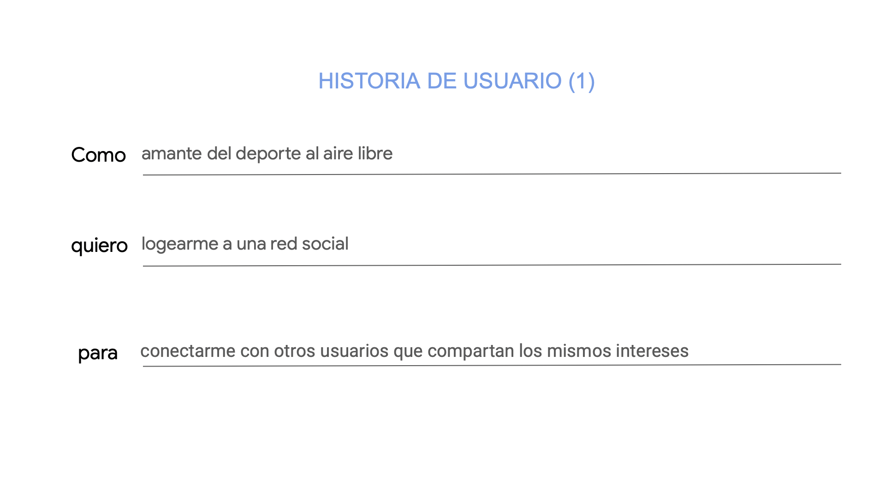
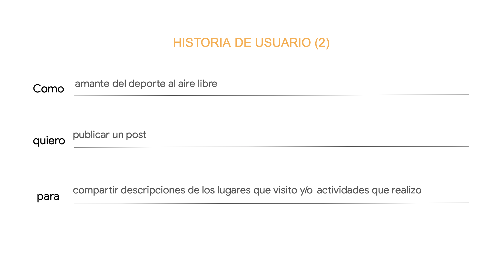
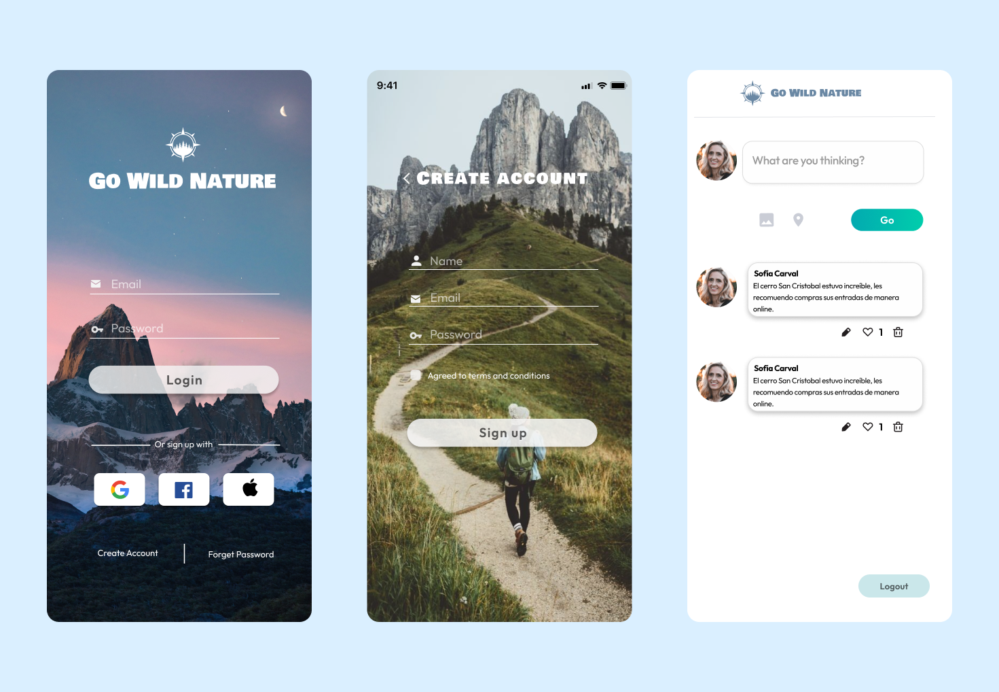
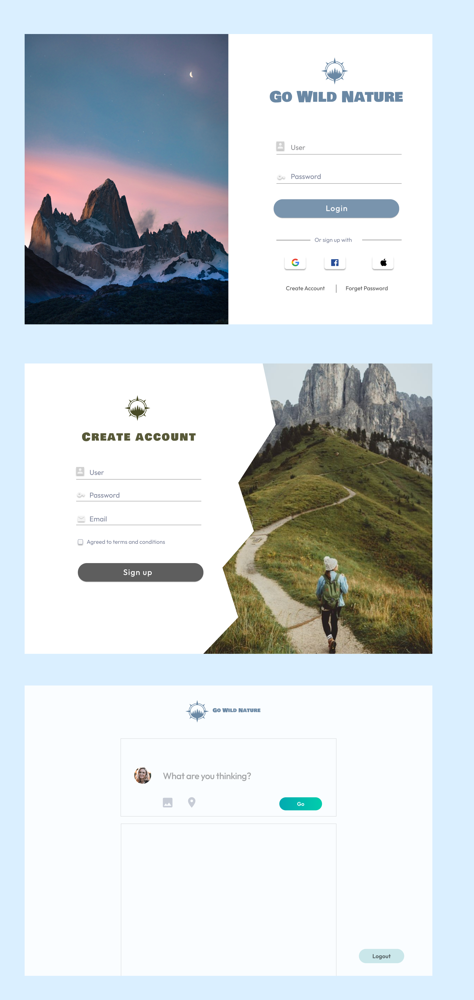

# Social Network 👩🏻‍💻

## Go Wild Nature🌿

Go Wild Nature es una red social para amantes de las actividades al aire libre.

## ¿Quiénes son los principales usuarios del producto?

Personas que disfrutan el deporte de aventura, caminar por montañas, bosques, selvas y todo aquello que les permita conectar con la naturaleza.

## ¿Qué problemas resuelve el producto y cómo se pueden beneficiar los usuarios?

Los usuarios entrevistados trasnmitieron la falta de acceso a una plataforma donde pudieran encontrar información relevante para planificar sus actividades al aire libre, algunos de los puntos mencionados fueron los siguientes:

- Conocer referencias sobre las instalaciones (Baños, sector de picnic).
- Brindar información sobre costos de acceso asociado.
- Conocer si el lugar a visitar cuenta con estacionamiento.
- Nivel de dificultad de la excursión que se desea realizar.
- Conocer las diferentes rutas que se pueden hacer.
- Compartir fotos de los lugares visitados.
- Compartir tips sobre equipamientos.

### Historia de usuario 1

---

### Historia de usuario 2

---

## Versión móvil del prototipo (alta fidelidad)

## Versión web del prototipo (alta fidelidad)

## Ver red social aquí 👇

Link:
